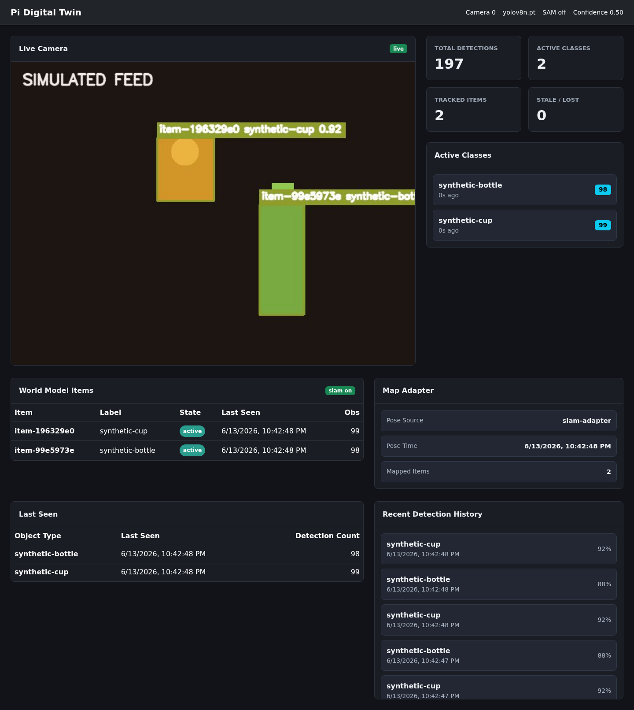

# video2world_model

Video-to-world-model prototype for turning captured video into reconstruction, map, and Isaac Sim/OpenUSD artifacts.



## Run

```bash
uv sync
uv run python app.py
```

Open `http://localhost:5000`.

## Test Without A Camera

```bash
DB_PATH=/tmp/video2world_model-fake.db SIMULATED_FEED=1 MOCK_DETECTIONS=1 uv run python app.py
```

This generates synthetic frames, fake detections, and simulated pose data so the full dashboard/API loop can be tested on any machine.

## Video to Robotics Sim

The offline pipeline turns a recorded walkthrough video into coarse robotics simulation artifacts:

```bash
uv run video-to-sim ./walkthrough.mp4 --out artifacts/walkthrough --sample-fps 2
```

Outputs:

- `metadata.json` and `frames/` from video ingest
- `reconstruction.json` and `point_cloud.ply` from reconstruction
- `scene.json`, `map/occupancy_grid.pgm`, and `map/occupancy_grid.yaml`
- `sim/scene.usda` for Isaac Sim/OpenUSD-style import
- `preview.png` and `preview.html` for quick local inspection

By default the pipeline uses a deterministic fallback reconstructor so the app works without model weights. To plug in VGGT, set `VGGT_COMMAND` to a command template that writes `reconstruction.json`:

```bash
uv sync --extra dev --extra vggt
VGGT_COMMAND="uv run vggt-reconstruct --frames {frames} --out {out} --max-frames 12 --max-points 60000 --coordinate-system isaac-z-up" uv run video-to-sim ./walkthrough.mp4 --out artifacts/walkthrough
```

The expected `reconstruction.json` shape is:

```json
{
  "source": "vggt",
  "scale": "relative",
  "camera_poses": [
    {
      "frame_id": 0,
      "timestamp_seconds": 0.0,
      "position": {"x": 0.0, "y": 0.0, "z": 1.5},
      "rotation_quat_xyzw": [0.0, 0.0, 0.0, 1.0]
    }
  ],
  "points": [
    {"x": 0.0, "y": 0.0, "z": 0.0, "confidence": 0.9}
  ]
}
```

### Public Test Video

For a real SLAM-style indoor test, use the TUM RGB-D `freiburg3_cabinet` RGB movie:

```bash
./scripts/download_tum_test_video.sh
uv run video-to-sim artifacts/test_videos/tum_freiburg3_cabinet_rgb.avi --out artifacts/tum_freiburg3_cabinet --sample-fps 2
uv run sim-preview artifacts/tum_freiburg3_cabinet
```

Run the same clip through VGGT instead of the deterministic fallback:

```bash
uv sync --extra dev --extra vggt
VGGT_COMMAND="uv run vggt-reconstruct --frames {frames} --out {out} --max-frames 8 --max-points 40000 --confidence-percentile 60 --preprocess-mode crop --coordinate-system isaac-z-up" uv run video-to-sim artifacts/test_videos/tum_freiburg3_cabinet_rgb.avi --out artifacts/tum_freiburg3_cabinet_vggt --sample-fps 1
```

VGGT output defaults to Isaac/USD's Z-up coordinate system. The exported USD keeps `World/ReconstructionPoints` visible and hides the generated `World/Floor` and coarse `World/CollisionObstacles` groups unless `SHOW_FLOOR=1` or `SHOW_COLLISION_BLOCKS=1` is set.

The source sequence is an Asus Xtion camera moving around an office pedestal, with RGB/depth movies and ground-truth trajectory available from TUM:

```text
https://cvg.cit.tum.de/data/datasets/rgbd-dataset/download
```

## World Model

The current world model is a pragmatic baseline, not a full neural scene model:

- YOLO detections, or mock detections in test mode
- label + bounding-box IoU association
- stable `item_id`
- `active`, `stale`, `lost` lifecycle
- SQLite tables for `items`, `observations`, and `camera_poses`
- optional SLAM pose input through `SLAM_POSE_FILE` or `SLAM_POSE_URL`

## Useful Config

- `CAMERA_INDEX=0`
- `FRAME_WIDTH=640`
- `FRAME_HEIGHT=480`
- `YOLO_CONFIDENCE=0.5`
- `DETECTION_INTERVAL=0.15`
- `ACTIVE_SECONDS=10`
- `LOST_SECONDS=60`
- `MATCH_IOU=0.35`
- `SEGMENTATION_MODEL=off`
- `DB_PATH=/path/to/detections.db`

## APIs

- `GET /api/status`
- `GET /api/summary`
- `GET /api/world`
- `GET /api/items/<item_id>`
- `GET /api/map`
